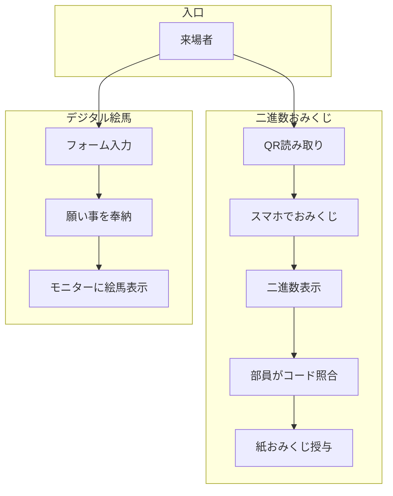

# tech-shrine

「Tech-Shrine」は、情報系の文化祭展示を想定した **デジタル参拝体験** の総称です。  
以下の2つのプロダクトで構成されています。

| プロダクト | 概要 | リポジトリ |
| :--- | :--- | :--- |
| **二進数おみくじ** | スマホで引ける二進数おみくじ。表示された数字を部員に伝えると紙のおみくじが授与される。 | [binary-omikuji](https://github.com/shimataiyaki/binary-omikuji) |
| **デジタル絵馬** | ニックネームと願い事を入力すると、モニターに絵馬として表示される。 | [digital-ema](https://github.com/shimataiyaki/digital-ema) |

## 展示コンセプト
- **テクノロジー × 神社体験**  
  情報系の技術（Webフロントエンド）と、実際の参拝動作（絵馬奉納・おみくじ）を融合。
- **参加者との会話を生み出す設計**  
  デジタルだけでは完結せず、部員とのやりとりが必ず発生する仕組み。

## リポジトリ構成（本リポジトリ）
```
/
├── binary-omikuji/     # 二進数おみくじ（Git Submodule または手動配置）
├── digital-ema/        # デジタル絵馬（同上）
├── docs/               # 全体資料（運用フロー・装飾デザイン等）
└── README.md           # 本ファイル
```

## 🎌 文化祭当日の全体運用フロー



### 運営のポイント
- **二進数おみくじ**：学校のChromebookと参加者のスマホを併用。  
- **デジタル絵馬**：展示側でChromebookを用意。不適切投稿防止のため **部員が目視確認** できる体制を推奨。

## 全体必要物品チェックリスト
- [ ] **共通**：Wi-Fi環境（もしくはオフライン動作確認）、装飾（鳥居・鈴・賽銭箱）
- [ ] **二進数おみくじ**：QRコード、コード対応表、紙おみくじカード
- [ ] **デジタル絵馬**：タブレット端末、大型モニター、HDMIケーブル

## 使用技術（共通）
- フロントエンド：HTML5 / CSS3 / JavaScript (ES6)
- ホスティング：GitHub Pages（各プロダクト個別）
- 開発スタイル：AI支援開発（Vibe Coding）

## ライセンス
各プロダクトともに MIT License。

## 🔗 関連リンク
- 制作者 note：[https://note.com/shimataiyaki](https://note.com/shimataiyaki)
- 二進数おみくじ 公開URL：[https://shimataiyaki.github.io/binary-omikuji](https://shimataiyaki.github.io/binary-omikuji)
- デジタル絵馬 公開URL：[https://shimataiyaki.github.io/digital-ema](https://shimataiyaki.github.io/digital-ema)
